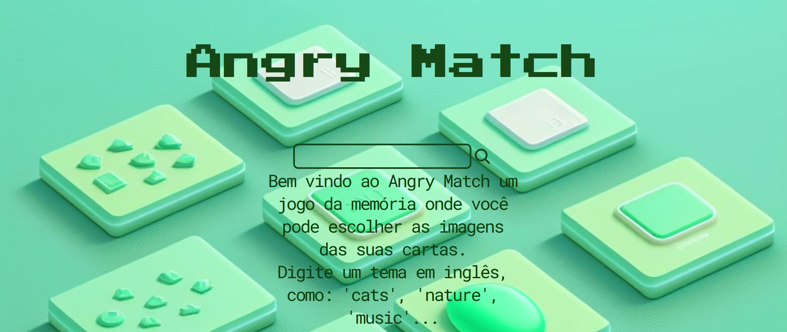
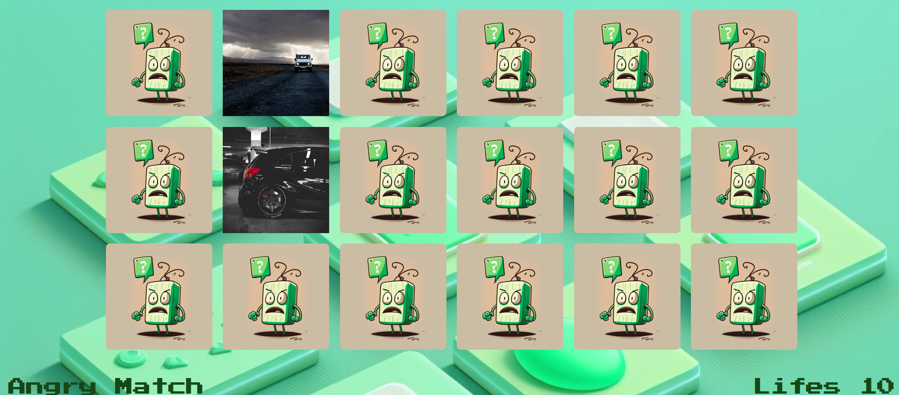
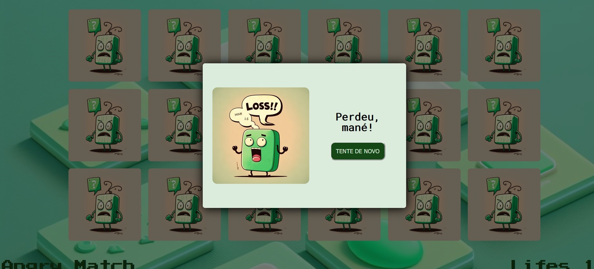

<h1 align="center">
    Angry Match Game
</h1>

### Link

https://angrymatch.netlify.app/

## Sobre



**Angry Match** é um jogo da Memória onde você pode escolher o tema das suas cartas. Nosso mascote se irrita facilmente, então preste bastante atenção.

## Ferramentas

- JavaScript
- React.js
- CSS (Styled Components)

## Objetivos

O maior objetivo desse projeto foi utilizar o React e também Styled Components. Utilizei a API do Unsplash para buscar as fotos.



O jogo funciona bem em dispositivos móveis, onde são gerados uma quantidade menor de cartas, para caber na tela. Há um limite de tentativas, em caso de derrota o jogador joga o mesmo jogo com as cartas embaralhadas, em caso de vitória ele volta para a tela inicial. Toda a arte foi criada no Midjourney.



## Instalação

```bash
    $git clone https://github.com/vitorMoraes03/react-memory-match-2.0.git
    $cd memory-game-2.0
    $npm install
```

